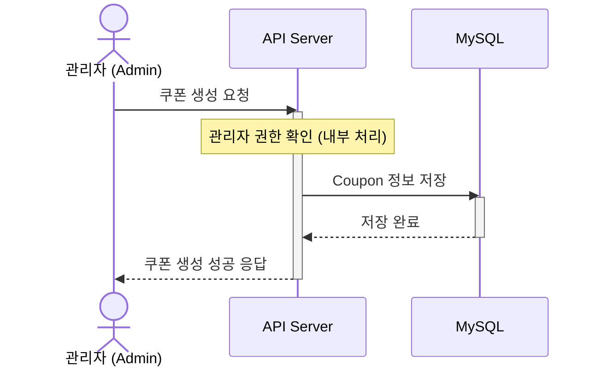
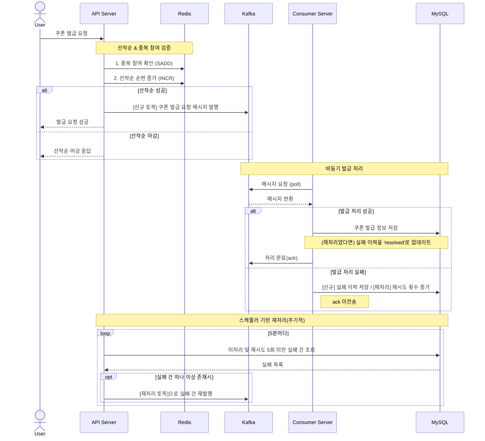
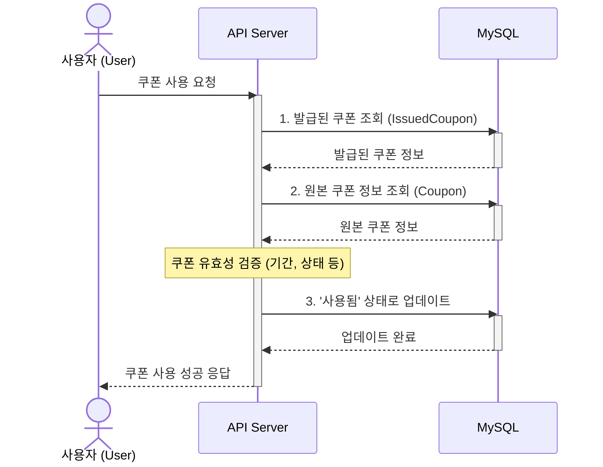

# 쿠폰 도메인 모델링

## 용어 사전 만들기

> 용어 사전은 프로젝트(또는 서비스)에 참여하는 도메인 전문가, 개발자, 기획자, 디자이너 등 다양한 직군 간의 의사소통을 명확하게 하기 위한 도구입니다. 이 사전은 하위 도메인과 바운디드 컨텍스트를 기준으로 도메인 내 개념을 일관되게 설명합니다.

하위 도메인은 자연스럽게 나뉘는 주제 영역입니다.

* 비즈니스 전체 흐름 속에서 각 영역이 무엇을 책임지는지에 따라 구분됩니다.

바운디드 컨텍스트는 시스템이 책임지는 논리적 경계입니다. (=개발자가 인위적으로 경계를 나누는 것)

* 개발자가 일하기 편하게 쪼갠 구현 단위이며, 내부에는 의미 있는 도메인 객체들이 존재하고 상호작용합니다.
* 같은 단어라도 컨텍스트마다 의미가 다를 수 있으므로, 언어와 의미가 일관되게 작동하는 유효 범위라고도 볼 수 있습니다.

즉, 하위 도메인은 '무엇'을 다루는지, 바운디드 컨텍스트는 '어디까지 책임질 것인지'를 결정한다고 이해하시면 됩니다.

### 하위 도메인

* User: 사용자 및 관리자 (아이디, 비밀번호, 권한)
* Coupon: 쿠폰 생성, 발급, 사용 등 전체 로직

### 바운디드 컨텍스트

| 바운디드 컨텍스트         | 설명                                                                |
|-------------------|-------------------------------------------------------------------|
| Auth              | 로그인 요청을 통해 Access Token을 발급하며, 해당 토큰을 기반으로 인증된 사용자를 식별하는 책임을 갖는다. |
| User              | 회원가입                                                              |
| Coupon            | 쿠폰 생성, 총 발급 수량 및 유효기간 관리                                          |
| IssuedCoupon      | 사용자에게 발급된 쿠폰 관리 (발급, 중복 방지, 사용 처리 등)                              |

---

### Auth (인증)

| 한글명     | 영문명           | 설명                                                |
| ------- | ------------- | ------------------------------------------------- |
| 액세스 토큰  | accessToken   | JWT 형식의 문자열로, 로그인 성공 시 사용자에게 발급되며, 인증에 사용됨        |
| 사용자 식별자 | userId        | 토큰 내부에 포함된 식별자. UUID 기반이며, 인증된 사용자를 식별하는 데 사용     |
| 인증 주체   | LoginUser     | `@AuthenticationPrincipal`을 통해 주입받는 인증된 사용자 정보 객체 |
| 토큰 발급기  | TokenCreator  | 사용자 식별자를 기반으로 accessToken을 생성하는 컴포넌트              |
| 토큰 제공자  | TokenProvider | JWT의 생성, 검증, payload 추출 등의 기능을 수행하는 저수준 컴포넌트      |

### User (사용자)

> 사용자 정보를 등록, 인증, 조회하고 권한을 관리하는 도메인입니다.

| 한글명    | 영문명      | 설명                            |
| ------ | -------- | ----------------------------- |
| 사용자 ID | id       | 내부 시스템에서 사용하는 고유 식별자 (UUID 등) |
| 아이디    | Username | 로그인 시 사용하는 식별자                |
| 비밀번호   | Password | 비밀번호 (암호화 저장)                 |
| 권한     | UserRole | ADMIN 또는 USER 값. 관리자/사용자 구분용  |

### Coupon (쿠폰)

> 쿠폰 발급의 템플릿을 정의하고, 쿠폰의 속성 및 정책을 관리하는 도메인입니다.

| 한글명        | 영문명                 | 설명                                                       |
|------------|---------------------|----------------------------------------------------------|
| 쿠폰 ID      | couponId            | 쿠폰 정의의 고유 식별자 (UUID)                                     |
| 쿠폰 이름      | couponName          | 쿠폰 제목                                                    |
| 쿠폰 타입      | couponType          | CHICKEN, PIZZA, BURGER 등                                 |
| 쿠폰 할인 유형   | couponDiscountType  | FIXED(정액), PERCENTAGE(정률)                                |                            
| 쿠폰 할인 금액   | couponDiscountValue | 	할인 금액(5,000원)                                           |
| 쿠폰 상태      | couponStatus        | PENDING(대기), ACTIVE(사용 가능), EXPIRED(만료됨), DISABLED(비활성화) |
| 쿠폰 총 발급 수량 | totalQuantity       | 발급 가능한 총 수량                                              |
| 유효 기간일     | expiredAt           | 유효 기간일                                                   |

### IssuedCoupon (발급된 쿠폰)

> 사용자에게 발급된 쿠폰을 관리하며, 발급, 중복 방지, 사용 처리 등의 비즈니스 로직을 포함하는 도메인입니다.

| 한글명      | 영문명             | 설명                      |
| -------- | --------------- | ----------------------- |
| 발급 쿠폰 ID | issuedCouponId  | 사용자에게 발급된 쿠폰의 고유 식별자    |
| 사용자 ID   | userId          | 해당 쿠폰을 발급받은 사용자         |
| 쿠폰 ID    | couponId        | 어떤 쿠폰이 발급되었는지 참조        |
| 발급일      | issuedAt        | 쿠폰이 발급된 시점              |
| 사용 여부    | used            | 쿠폰이 사용되었는지 여부 (boolean) |
| 사용일      | usedAt          | 쿠폰 사용 시점                |
| 중복 방지 키  | userId+couponId | 복합 유니크 키로 중복 발급 방지      |

### FailedIssuedCoupon (쿠폰 발급 실패 이력)

> 쿠폰 발급 처리 도중 실패한 이력을 저장하고, 추후 재처리 스케줄러 or DLQ 에서 재시도하는 도메인입니다.

| 한글명    | 영문명        | 설명                                         |
| ------ | ---------- | ------------------------------------------ |
| 실패 ID  | id         | 실패 이력의 고유 식별자 (UUID)                       |
| 사용자 ID | userId     | 발급 실패가 발생한 사용자 식별자                         |
| 쿠폰 ID  | couponId   | 발급에 실패한 쿠폰의 식별자                            |
| 재시도 횟수 | retryCount | 해당 실패 이력에 대해 재시도한 횟수                       |
| 해결 여부  | isResolved | 실패 건이 정상적으로 재처리되어 해결되었는지 여부 (`true` = 해결됨) |
| 실패 일시  | failedAt   | 쿠폰 발급 실패가 발생한 시점                           |

---

## 모델링 하기

> 모델링은 하위 도메인과 바운디드 컨텍스트를 기준으로 도메인 객체를 설계하고, 해당 객체의 속성(상태), 행위(기능), 정책(제약사항)을 구분하여 구조화하는 작업입니다.
>
> 이 과정은 협업 부서와 개발자가 도메인 개념을 명확히 이해하고 일관되게 구현할 수 있도록 돕는 설계/문서화 작업입니다.
>
> 본 프로젝트에서는 JPA를 사용하므로, 도메인 객체를 JPA 엔티티로 정의하고, 이를 기준으로 모델링을 진행합니다.

---

### Auth (인증)

속성(상태)

* 사용자는 로그인 시 아이디, 비밀번호를 입력한다.
* 로그인에 성공하면 서버는 accessToken을 발급한다.

행위(기능)

* 로그인 요청을 처리하고 사용자 인증에 성공하면 accessToken을 생성하여 반환한다.
* accessToken을 검증하고 사용자 식별자(UUID)를 추출한다.
* 인증된 사용자 정보를 컨트롤러에서 주입받을 수 있도록 한다 (`@AuthenticationPrincipal`).

정책(제약사항)

* 로그인 시 입력한 아이디/비밀번호가 DB에 저장된 값과 일치해야 한다.
* accessToken은 만료 시간이 있으며, accessToken의 만료 여부는 서버에서 검증되며, 만료된 토큰은 인증 실패로 간주된다.
* accessToken은 DB에 저장하지 않고 stateless하게 처리된다. (accessToken은 별도의 저장소(DB)에 저장되지 않고, 자체 정보(payload)를 통해 사용자를 식별한다)
* 인증은 accessToken의 유효성과 payload에 포함된 UUID를 기반으로 수행된다.

### User (사용자)

속성(상태)

* 사용자는 회원가입할 때 등록할 아이디와 비밀번호가 있다.

행위(기능)

* 사용자는 아이디와 비밀번호를 가지고 회원가입할 수 있다.
* 아이디와 비밀번호를 가지고 로그인을 할 수 있다.

정책(제약사항)

* 회원가입
  * 아이디 또는 비밀번호는 1자 이상이어야 한다.
  * 중복된 아이디는 존재할 수 없다.
  * 비밀번호는 암호화하여 저장해야 한다.

* 로그인
  * 로그인 시 아이디와 비밀번호가 입력해야 한다.

### Coupon (쿠폰)

속성(상태)

* 쿠폰에는 쿠폰 이름, 쿠폰 타입, 쿠폰 할인 유형, 쿠폰 할인 금액, 쿠폰 상태, 쿠폰 총 발급 수량, 유효 기간일가 있다.
* 쿠폰 타입에는 치킨(`CHICKEN`), 햄버거(`HAMBURGER`), 피자(`PIZZA`)가 있다.
* 쿠폰 상태는 `PENDING`(대기), `ACTIVE`(사용 가능), `EXPIRED`(사용됨), `DISABLED`(사용 불가)가 있다.

행위(기능)

* 관리자는 쿠폰을 **생성**할 수 있다.
* 쿠폰의 유효기간에 따라 상태를 만료 처리할 수 있다.

정책(제약사항)

* 쿠폰 생성
  * 발급 가능 수량과 유효기간이 설정되어야 한다.
  * 쿠폰 발급 수량은 1 이상이야 한다.
  * 유효 기간일(expiredAt)이 지나면 쿠폰 상태는 `EXPIRED` 로 변경될 수 있다.

#### 처리 흐름: 쿠폰 생성

### IssuedCoupon (발급된 쿠폰)

속성(상태)

* 사용자 ID, 쿠폰 ID, 발급일, 사용 여부, 사용일

행위(기능)

* 쿠폰 발급 요청을 처리할 수 있다.
* 발급된 쿠폰을 사용 처리할 수 있다.

정책(제약사항)

* 쿠폰 발급
  * 해당 쿠폰이 존재해야한다.
  * 현재 쿠폰이 발급 가능한 상태(ACTIVE)여야 한다.
  * **중복 발급 방지**
    * 동일 사용자에게 동일 쿠폰은 1회만 발급 가능 → `userId + couponId` 유니크
  * 해당 쿠폰의 발급 수량이 초과되어서는 안된다.

* 쿠폰 사용
  * 발급받지 않은 쿠폰은 사용할 수 없다.
  * 사용된 쿠폰은 재사용이 불가능하다.
  * 유효 기간이 지난 쿠폰은 사용할 수 없다.

#### 처리 흐름: 쿠폰 발급

#### 처리 흐름: 쿠폰 사용

### FailedIssuedCoupon (쿠폰 발급 실패 이력)

속성(상태)

* 실패 ID, 사용자 ID, 쿠폰 ID, 실패 일시(=생성일), 재시도 횟수, 해결 여부

행위(기능)

* 재처리 스케줄러가 해결되지 않은(isResolved = false) 실패 건을 조회한다.
* 실패 건을 재처리(쿠폰 발급 재시도)한다.

정책(제약사항)

* 재시도 횟수(retryCount)가 5회를 초과하면 더 이상 재시도하지 않는다. (확장되면 관리자 또는 운영자에게 알림을 보낼 수 있다.)
* 재처리에 성공하면 `isResolved`를 `true` 로 변경한다.
